# ERD

Solid lines are foreign keys; labels name the role. All vocabularies shown
as free text (kind, category, link_kind, scope_kind) are adapter-owned.

```mermaid
erDiagram
    sources ||--o{ raw_documents : ""
    sources ||--o{ claim_sources : ""
    sources ||--o{ event_sources : ""
    sources ||--o{ statement_provenance : ""

    raw_documents ||--o{ extraction_units : ""

    entities ||--o{ entity_names : ""
    entities ||--o{ events : "location"
    entities ||--o{ event_participants : ""
    entities ||--o{ claims : "subject / object"
    entities ||--o{ relationships : "from / to"

    events ||--o{ event_participants : ""
    events ||--o{ event_links : "from / to"
    events ||--o{ event_sources : ""
    events ||--o{ statement_provenance : ""

    claims ||--o{ claim_versions : ""
    claims ||--o{ claim_sources : ""
    claims ||--o{ relationships : "justifies"
    claims ||--o{ contradiction_claims : ""
    claims ||--o{ statement_provenance : ""
    claims ||--o{ validation_verdicts : ""

    claim_versions ||--o{ claim_sources : "version-pinned"
    claim_versions ||--o{ contradiction_claims : "version pin"

    contradictions ||--o{ contradiction_claims : ""

    relationship_types ||--o{ relationships : ""
    relationship_types ||--o{ relationship_type_aliases : ""
    relationship_types ||--o{ relationship_types : "inverse_of"

    statements ||--o{ statement_provenance : ""
    statements ||--o{ factcheck_verdicts : ""
    statements ||--o{ factcheck_flags : "record_id"
    statements ||--o{ review_items : ""

    pipeline_runs ||--o{ model_outputs : ""
    pipeline_runs ||--o{ extraction_units : ""
    pipeline_runs ||--o{ validation_verdicts : ""
    pipeline_runs ||--o{ validation_flags : ""
    pipeline_runs ||--o{ factcheck_verdicts : ""
    pipeline_runs ||--o{ factcheck_flags : ""
    pipeline_runs ||--o{ review_items : ""
```



## Confidence order

`claims.confidence` (and the provenance/verdict columns that mirror it) is
fixed at four levels, ordered; machine passes may only move a value **down**
this list:

```
established  →  derived_probable  →  contested  →  abandoned_version
```

Display names per level are adapter configuration; the codes and their
semantics are engine-fixed:

| level               | semantics                                            |
| ------------------- | ---------------------------------------------------- |
| `established`       | stated directly by a top-tier authoritative source   |
| `derived_probable`  | inferred from sources, high confidence               |
| `contested`         | traditions disagree; versions preserved              |
| `abandoned_version` | a version the domain's authoritative track abandoned |

## Idempotency keys

| ledger                 | key                                                    |
| ---------------------- | ------------------------------------------------------ |
| `extraction_units`     | `(unit_key, prompt_version)` + `input_hash` drift guard |
| `validation_verdicts`  | `(claim_id, prompt_version)`                           |
| `factcheck_verdicts`   | `(statement_id, prompt_version, checksum, revision_round)` |
| `validation_flags`     | `(check_code, record_kind, record_id)` — refresh, never clobber |
| `factcheck_flags`      | `(check_code, record_kind, record_id)` — same contract |
| `review_items`         | one open row per `(kind, statement_id)`; reappearing findings open new rows |
| `raw_documents`        | `(url, revision)` — re-ingest appends, never overwrites |
